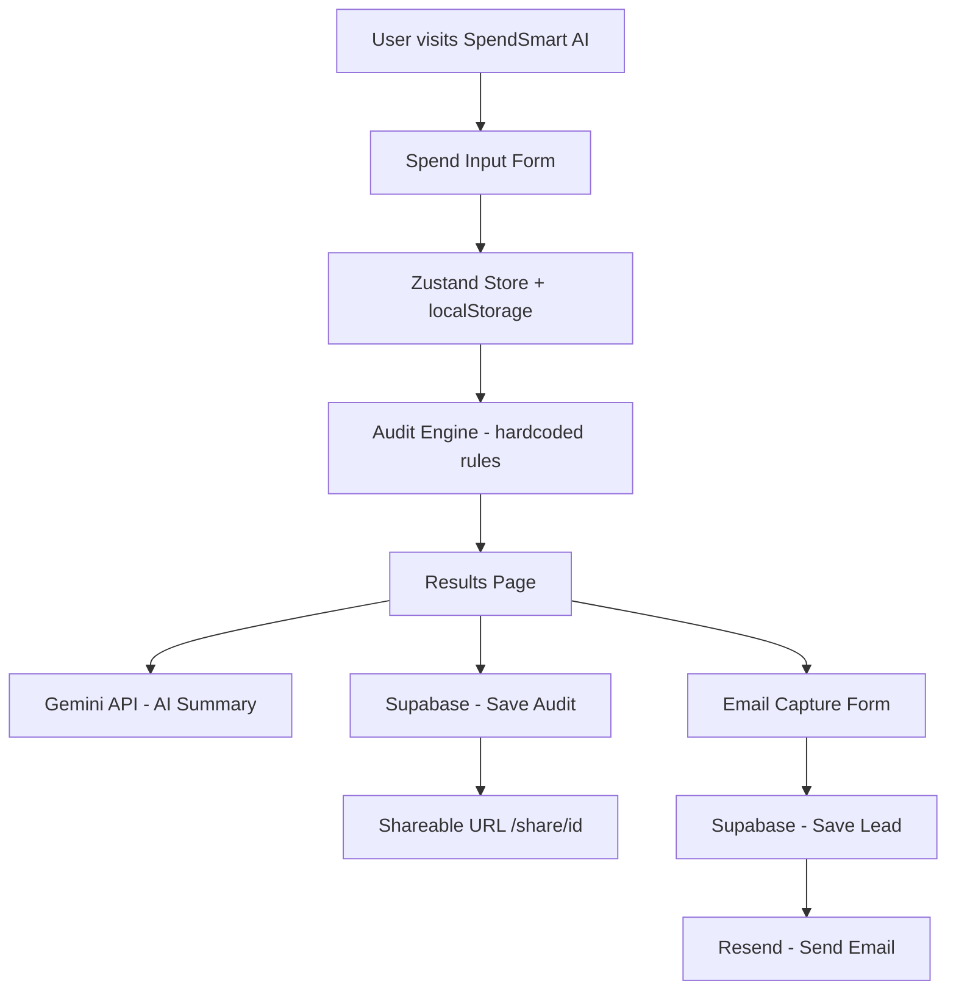

# Architecture

## System Diagram

## Data Flow

1. User fills the spend input form with their AI tools, plans, seats, and monthly spend
2. Zustand store persists form state to localStorage so data survives page reloads
3. On submit, the audit engine runs purely client-side with hardcoded rules — no API call needed
4. Results page renders instantly with per-tool recommendations and total savings
5. In parallel, a POST request to /api/summary calls Gemini API for a personalized paragraph
6. The audit is saved to Supabase via /api/audits with a unique random ID
7. A shareable URL is generated at /share/[id] — personal details are stripped
8. User optionally enters email — saved to Supabase leads table and triggers Resend email

## Stack

- **Framework:** Next.js 15 + TypeScript — chosen for unified frontend/backend in one project, ideal for a 7-day build
- **Styling:** Tailwind CSS — full design control without component library overhead
- **State:** Zustand with persist middleware — clean API, built-in localStorage persistence
- **Database:** Supabase (Postgres) — generous free tier, instant REST API, RLS security
- **Email:** Resend — modern API, reliable free tier, great developer experience
- **AI:** Gemini API — free tier available, sufficient for 100-word summaries
- **Deployment:** Vercel — zero-config Next.js deployment, global CDN

## What I would change at 10k audits/day

- Add Redis caching for audit results to avoid repeated Supabase reads on shared URLs
- Move audit engine to a dedicated API route to enable server-side logging and analytics
- Add a job queue (BullMQ or Inngest) for email sending to handle spikes gracefully
- Add Supabase indexes on created_at and total_monthly_savings for faster queries
- Add rate limiting per IP on the /api/leads route using Upstash Redis
- Consider edge runtime for /api/summary to reduce Gemini API latency globally
